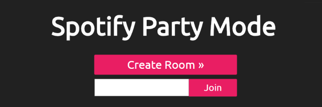
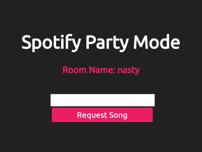
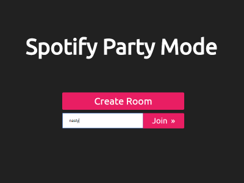
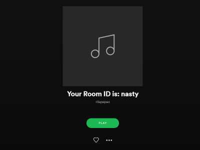

Spotify Party Mode
==================
A web application that allows collaborative editing of Spotify playlists.\
Create or join virtual party rooms and request songs to be played!\
Received *Best Miscellaneous Hack* at SBUHacks 2018.

**Authors**: [@cxyStephen](https://github.com/cyxStephen), [@aandycen](https://github.com/aandycen), and [@victorsch](https://github.com/victorsch)

* * *
#### Demo

Party host creates a party room and distributes the room name (`nasty` in this case).

Others can join the room to request songs.

A public Spotify playlist is generated and can be played from the party host’s device or shared.

* * *
#### Built using
* **Angular** 6.2.2
* **Flask** 1.0.2

* * *
*deployed during hackathon to [spotifypartymode.com](http://www.spotifypartymode.com), backend is currently defunct.*
